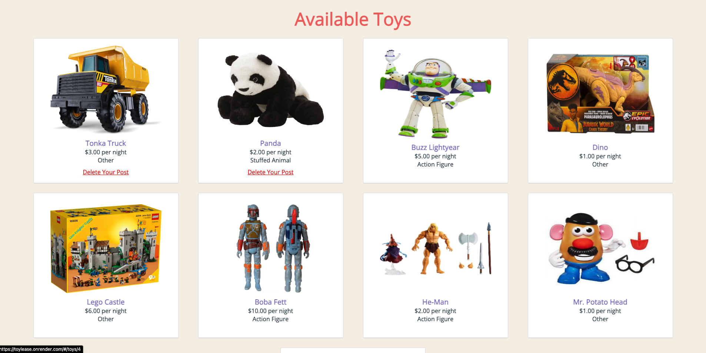

# ToyLease

Everyone has toys that are too sentimental to sell but so old and dated you don't use them anymore. Instead of letting those old toys collect dust, make some money from them by letting others rent them via [ToyLease](https://toylease.onrender.com). ToyLease gives other people a chance to experience the magic of your preloved toys and you get to make a quick buck. It's a win-win really.

[ToyLease Live Site](https://toylease.onrender.com)

[ToyLease Wiki](https://github.com/ckane30691/ToyLease/wiki)

## Site Features:

## User Auth

Only users with accounts can browse the marketplace

## Toys

View all the toys available

Post your own preloved toys!

## Leasings

Lease your new favorite toys!

View your lease history

## Spotted a bug?

If you find a bug, please open an issue [here](https://github.com/ckane30691/ToyLease/issues/new).

## Technologies Used:

- [Ruby on Rails](http://rubyonrails.org/) - Server-side MVC Framework
- [PotsgreSQL](https://www.postgresql.org/) - Database management system
- [React](https://reactjs.org/) - JS library for building user interfaces
- [Redux](http://redux.js.org/) - Frontend architecture for giving apps a predictable state
- [Render](https://www.render.com) - Cloud platform that lets companies build, deliver, monitor and scale apps
- [Webpack](https://webpack.js.org/) - Bundler for keeping JS files modular
- [Babel](https://babeljs.io/) - Transpiler for backwards compatibility
- [Coudinary API](https://cloudinary.com/) - Cloud service for uploading images
- [AWS S3 Buckets](https://aws.amazon.com/s3/) - Cloud Service for serving images

## Future Directions for ToyLease

- Implement Email Messaging
- Implement Reviews
- Implement User Profiles
- Implement Toy Search
